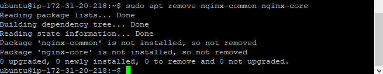
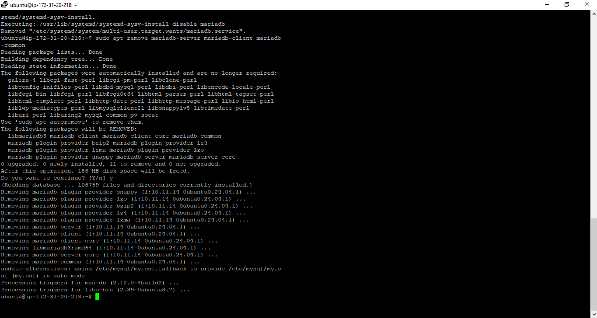
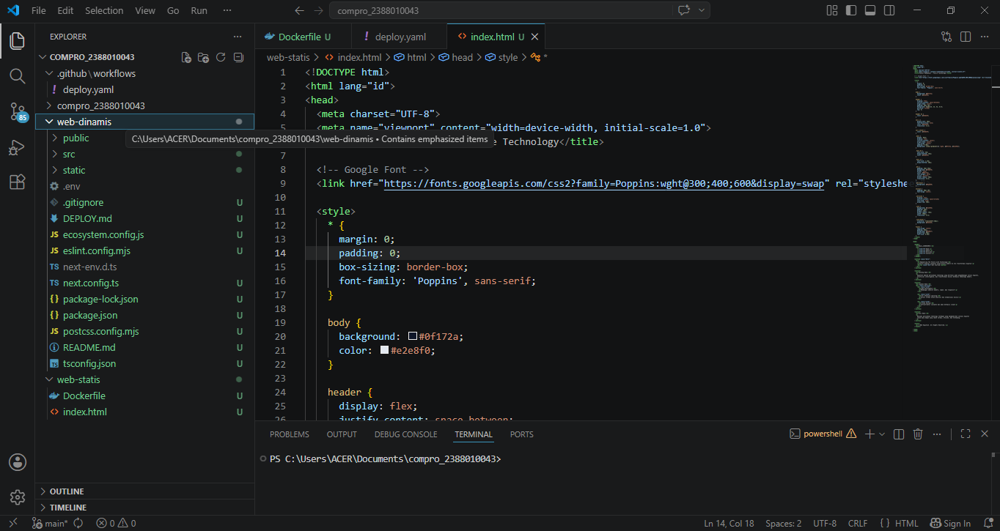
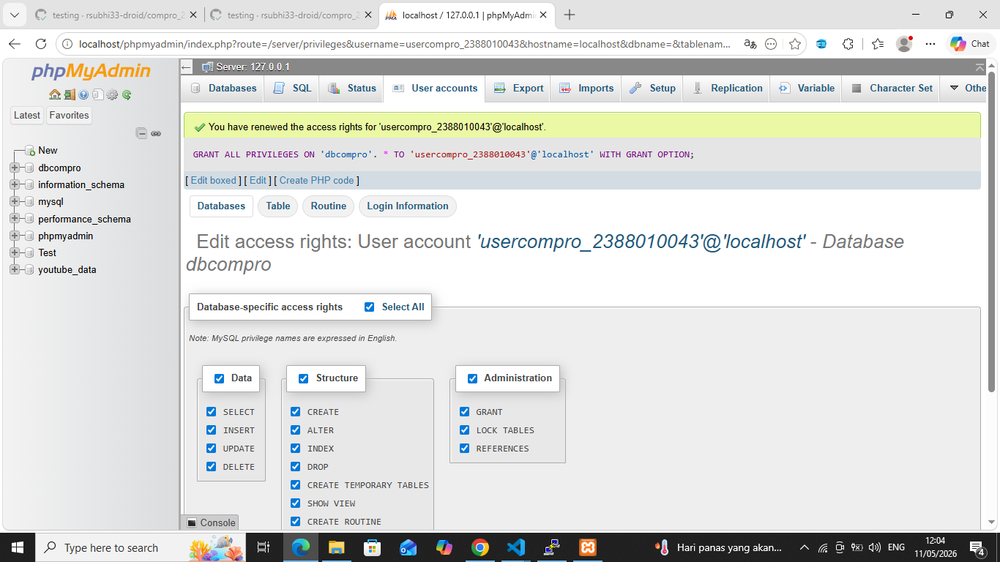
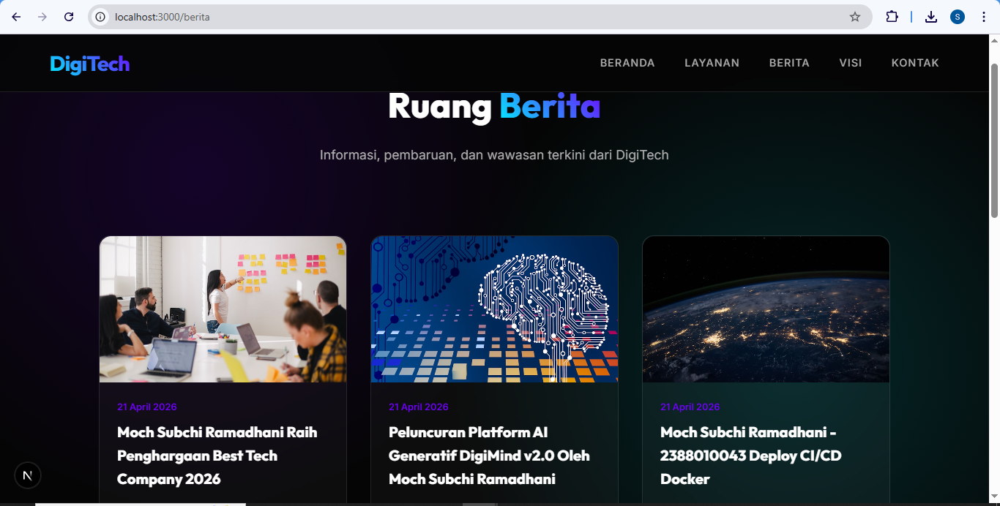

# Deploy Multi Apps CI/CD Docker

1. Start instance di AWS EC2
2. Patching OS -> sudo apt update && sudo apt upgrade
3. Hapus layanan nginx dan uninstall -> sudo systemctl stop nginx && sudo systemctl disable nginx
    sudo apt remove nginx-common nginx-core
    

4. Hapus layanan Mariadb dan uninstall -> sudo systemctl stop mariadb && sudo systemctl disable mariadb
    sudo apt remove mariadb-server mariadb-client mariadb-common
    
5. Testing Next.JS + db di local environment
    - Copy Project Digitecth pada pertemuan6 kecuali folder .next, node_modules, sql kedalam folder web-dinamis
    

    - Create user baru bukan root di DBMS (Laragon, xampp, etc)
    

    - sesuiaikan isi file .env
    - open terminal -> cd web-dinamis
    - npm i
    - npm run dev
    - Edit Berita ke-3 menjadi = nama-nim CI/CD mengunakan Docker
    