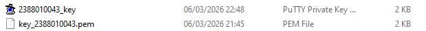

# Remote Instance with SSH putty

1. Pastikan sudah install putty

2. Koneversi file public key dari .pem menjadi .ppk di putty
   - buka puttyGen
   - load File .pem
   - Save as .ppk

3. set up putty untuk Remote SSH
   - buka apps putty
   - isi IP public sesuai instance (AWS - Public IPv4 address) / pada menu EC2 instance
   - isi port untuk SSH sesuai Security Group di instance
   - isi nama session (NIM_server) agar saat connetct lagi tinggal load saja
   - load File .ppk (klik SSH -> Auth -> Credentials -> load File .ppk)
   - Kembali ke session klik save
   - klik Open
   - Masukan username sesuai instance

4. "sudo apt-get Update" (Update OS) lanjut "sudo apt-get Upgrade"

5. Pembuktian Remote SSH secara Visual
   - copy Public IP Address instance paste ke browser
   - install web server seperti Apache/Nginx 
   - sudo apt install apache2
   - Reload browser

6. matikan instance agar tidak kena tagihan
   - sudo shutdown now 