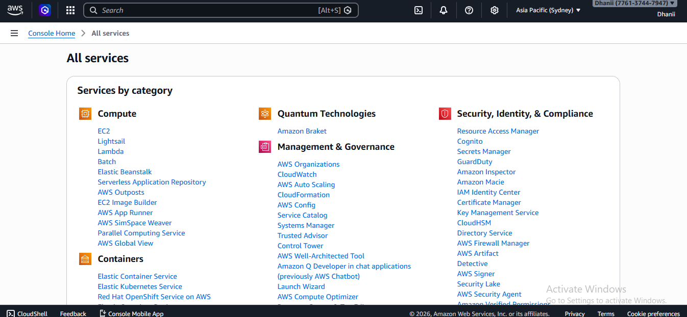

# membuat EC2 / instance / vm

1. pilih menu all services --> klik EC2

2. didalam menu EC2 pilih instance

3. didalam menu instance pilih launch instance

4. beri nama instance dengan format NIM_server

5. kita pilih OS server unutk instance

6. pilih resource instance T3.Micro (2VCPU, 1GB Memory)

7. Membuat key pair, pilih New key Pair, isi nama key, pilih RSA, format File .pem, create key pair

8. setting kebijakan keamanan / security group
   - Allow SSH -> ARtinya membolehkan remote SSH dari luar
   - Allow HTTPS -> Artinya instance bisa di akses dari protocol HTTPS
   - Allow HTTP -> Artinya instance bisa di akses dari protocol HTTP