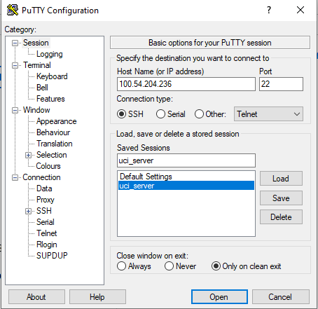
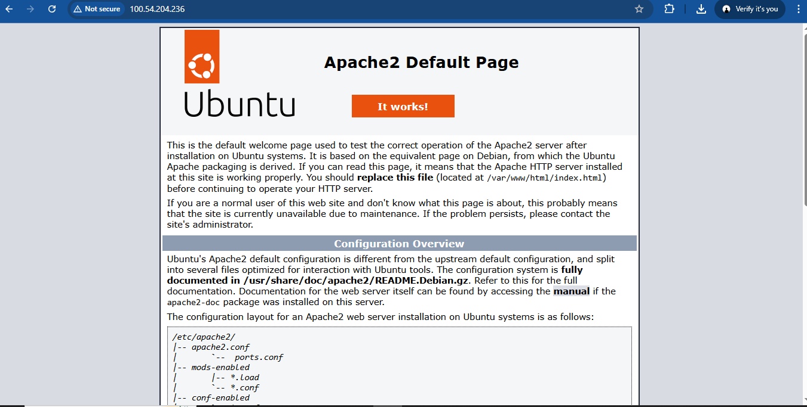
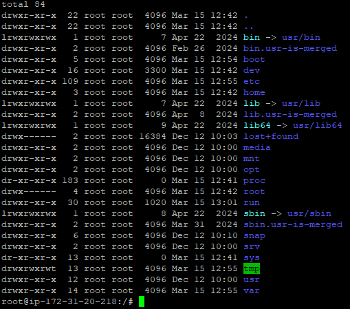
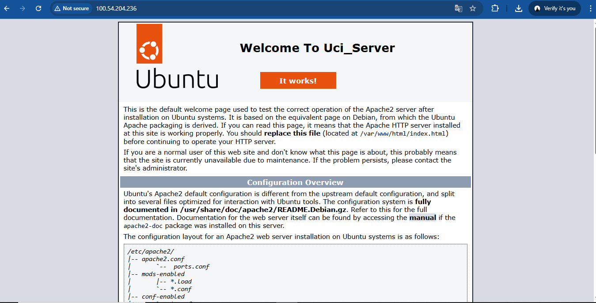

### Implementasi beberapa comand line interface Linux Ubuntu

1. start Instance
2. Buka putty
3. Kemudian Load save session yang disimpan pada pertemuan 2 (NIM_server)
4. Update bagian IpAddress V4 (lngsng open)

5. sudonapt-get update (untuk Paching OS Linux server)
6. cek web server kita (sudo systemctl status apache2)
7. sudo systemctl stop apache2 (untuk berhentikan  web server)
8. sudo systemctl start apache2 (untuk start ulang web server)

9. masukan cd ../.. untuk ke root folder ls -la
10. masukan sudo su (untuk masuk ke home)
11. masukan command (ls -la) untuk melihat directory tempat cursor aktif

12. masuk ke folder Var (cd var/www/html)
13. nano index.html untuk custom Nama dan NIM (cara save: ctrl+x, y,enter)

