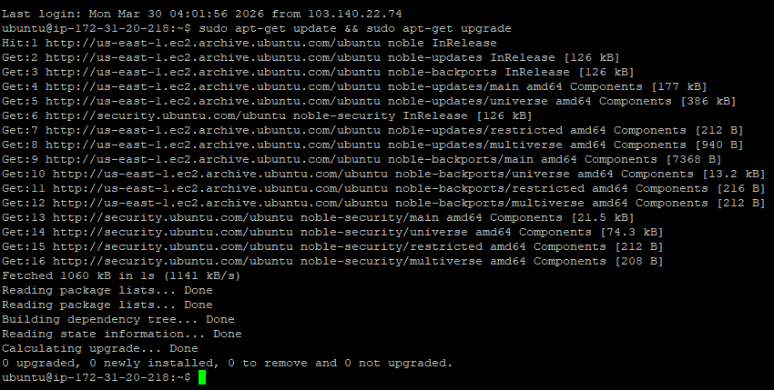
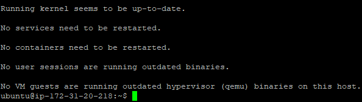
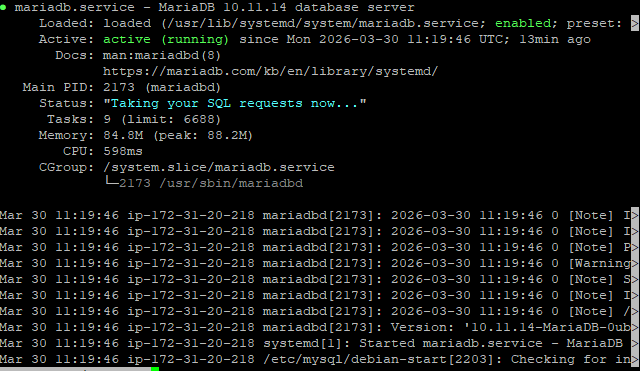
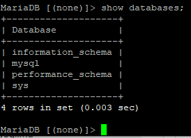
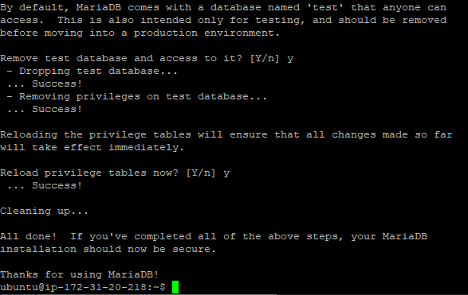
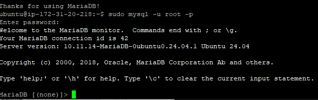
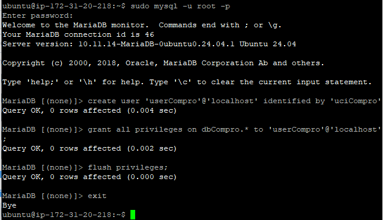
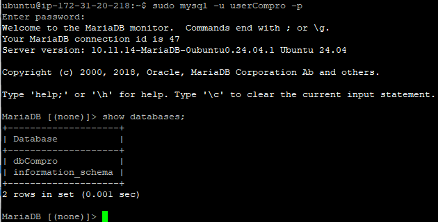

## Membuat Database Mysql di AWS EC2

1. Aktifkan instance 

2. Remote SSH via Terminal 
    - Masuk ke folder penyimpanan private key (Cari folder klik kanan-pilihterminal sambil klik shift dan ctrl)
    - Masukan comman ssh -i key_2388010043.pem ubuntu@54.159.21.138
    - Tekan Enter

3. Lakukan Pathching OS
    - sudo apt-get update && sudo apt-get upgrade
    

4. Install MariaDB
    - sudo apt-get install mariadb-server
    
    - sudo system start mariadb
    - sudo system status mariadb
    
    - coba aoakah default setting yang berlaku (sudo mysql -u root -p)
    - cek apakah masih ada database dummy (show databases;)
    

5. Kita lakukan Hardening Security
    - Masukan command sudo mysql_secure_installation
    - Switch to unix_socket authentication : Y
    - Change the root password? : Y
    - Remove anonymous users? : Y
    - Disallow root login remotely? : Y
    - Remove test database and access to it? : Y
    - Reload privilege tables now? : Y
    
    - Cek kembali apakah masih bisa login tanpa password
    
    dan ternyata tidak bisa (berhasil)

6. Membuat database dan user
    - Membuat database untuk web company profile (create database dbCompro;)
    - Membuat user untuk web company profile (create user 'userCompro'@'localhost' identified by '*********';)
    - Memberikan Hak akses user untuk web company profile (grant all privileges on dbCompro.* to 'userCompro'@'localhost';)
    - flush privileges
    

7. Login menggunakan akun database yang sudah di buat
    - login menggunakan username (sudo mysql -u userCompro -p)
    - enter password yang sudah di buat (uciCompro)
    - lihat database yang sudah dibuat (show databases;)
    
