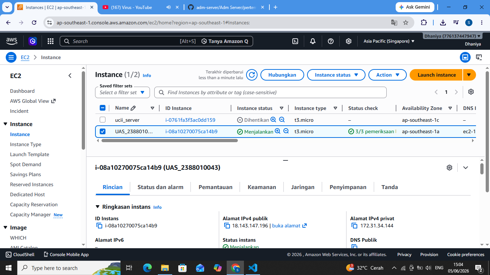
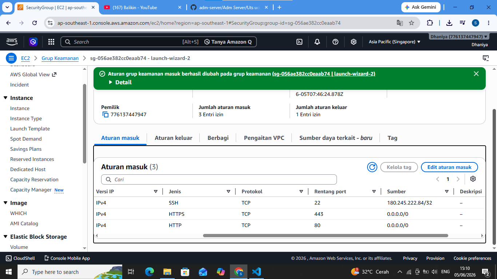
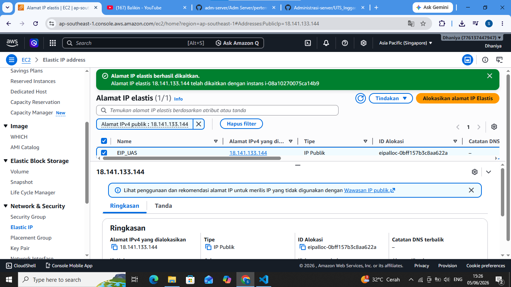
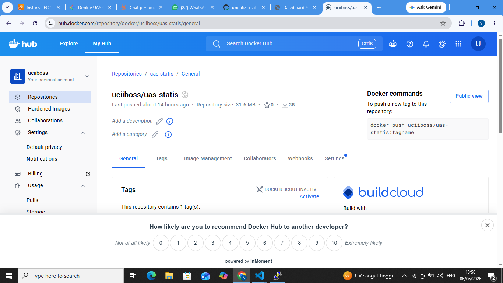
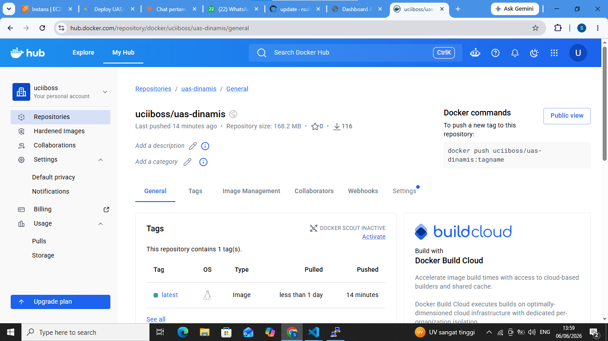
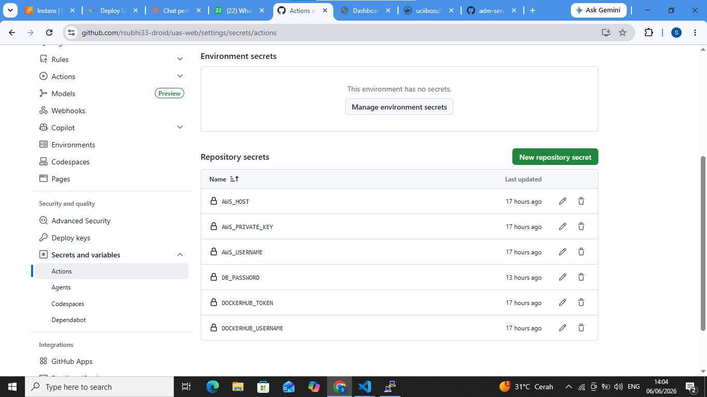
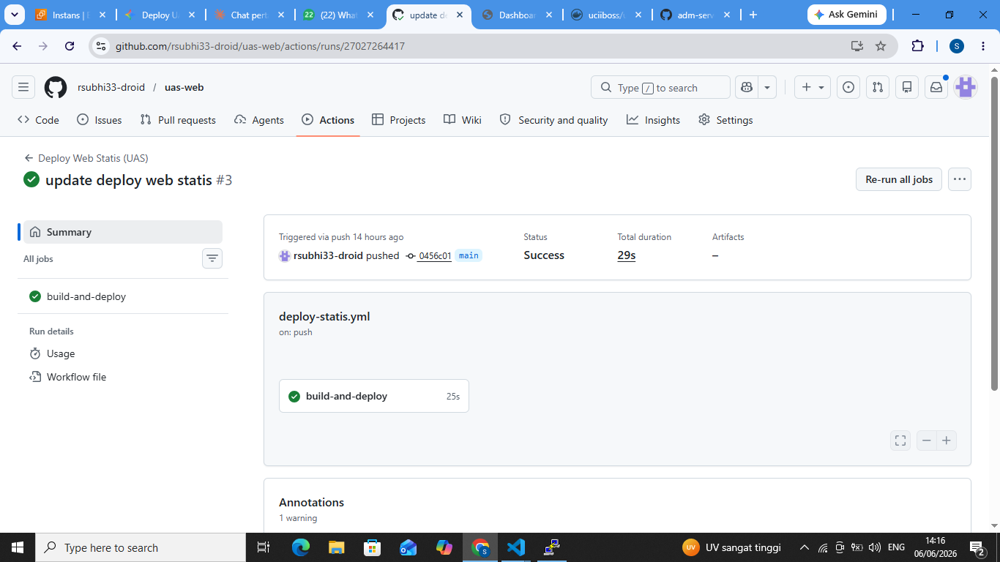
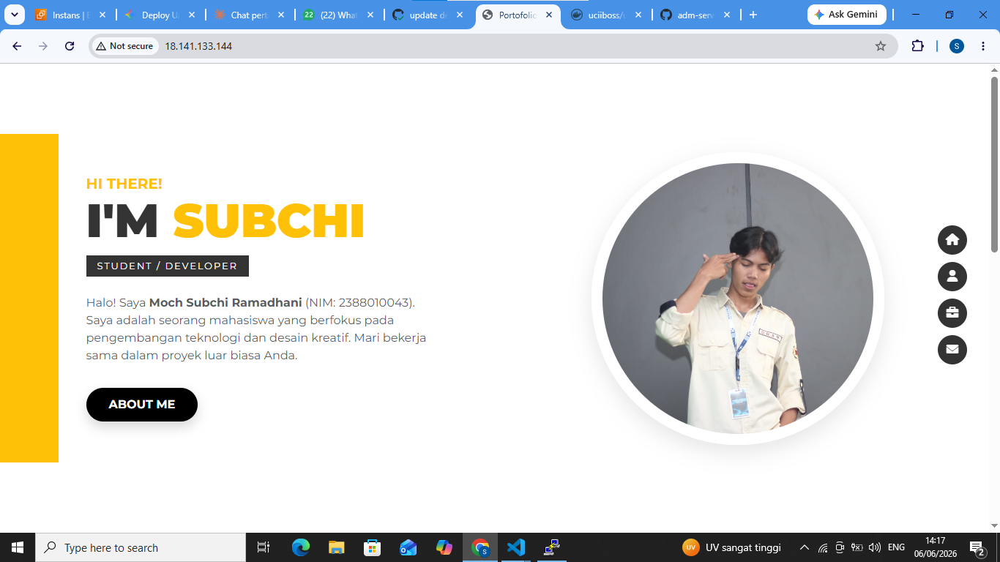
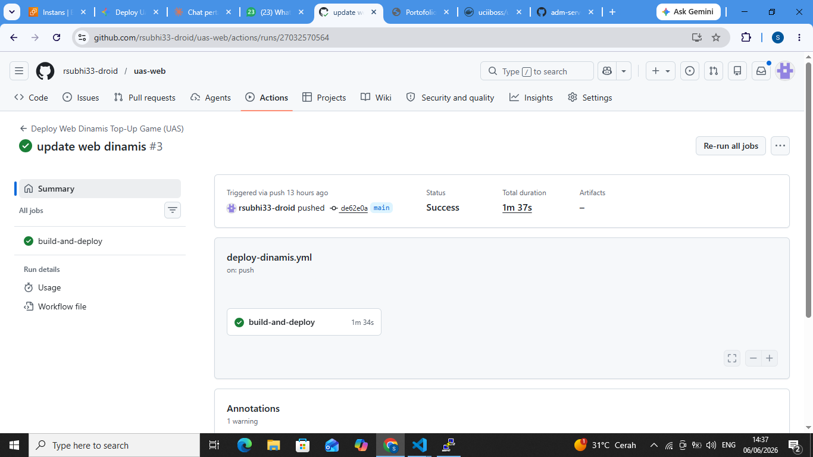

## Komponen dan Infrastruktur

1. Membuat Instance baru

2. Setting security group

3. Membuat Elastic IP

4. Karena kita menggunakan instance baru, install based docker dokumen https://docs.docker.com/engine/install/ubuntu/
5. Membuat Repository baru di docker.hub untuk web-statis & web-dinamis

6. Membuat Repository di github untuk uas web-statis & web-dinamis
7. Mengisi Secrets Variable di github action

8. Melakukan Edit File Pipeline di Github
   - didalam web-statis buat file index.html dan Dockerfile (bisa buat baru atau mengambil dari web cv saat uts)
   - Buat Folder Baru .github -> Buat folder workflows -> Buat File deploy-statis.yml
9. Sebelum melakukan commit dan synch pada file
   - Pastikan user ubuntu sudah ditambahkan ke docker -> sudo usermod -aG docker ubuntu
   - Baru lakukan commit dan push ke Github
   
10. Cek apakah web-statis sudah berjalan dengan baik

11. Deploy Multiple Container menggunakan Docker Compose
12. Buat file Dockerfile
13. Buat file docker-compose.yml
14. Buat Workflows File -> deploy-dinamis.yml di folder .github/workflows/
15. Buat juga Struktur folder web dinamis seperti yang kita mau
16. Edit File -> deploy-dinamis.yml di folder .github/workflows/
17. Commit & Push Changes ke GitHub
18. Cek di Github, apakah actions jalan dan berhasil

19. Akses web melalui Browser dengan Port 3000

Referensi: https://github.com/rsubhi33-droid/uas-web
