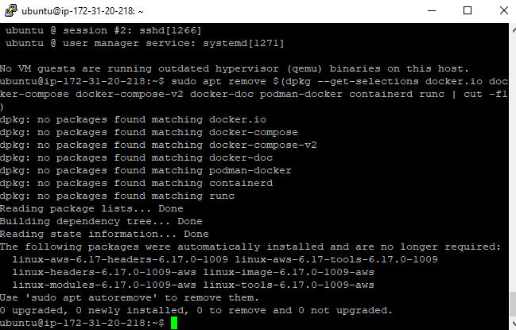
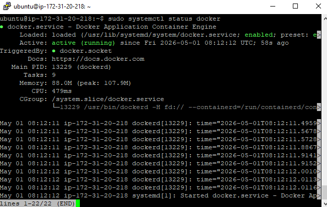
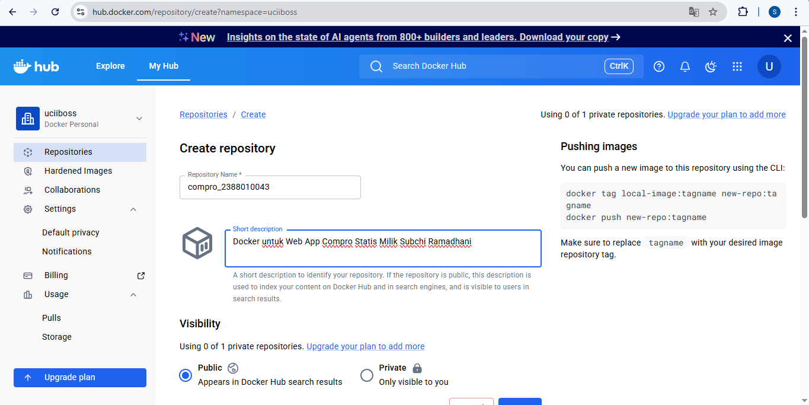
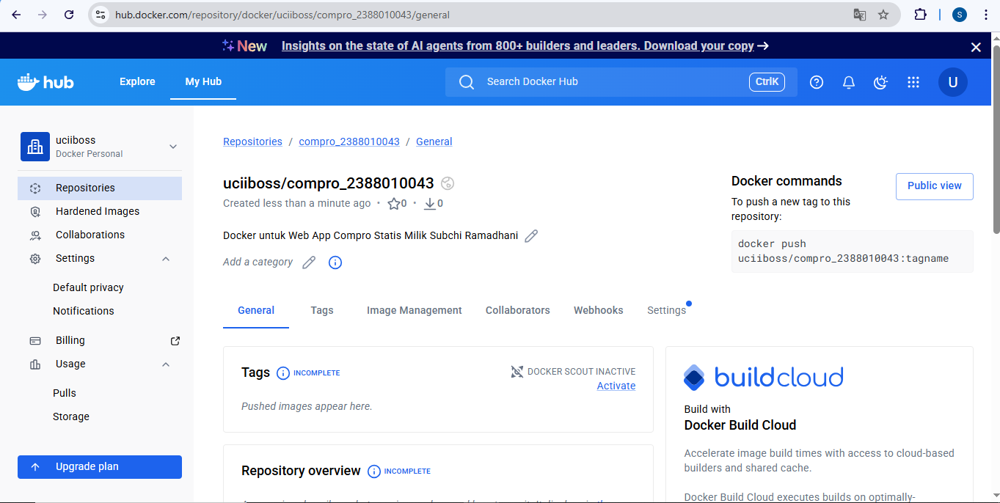
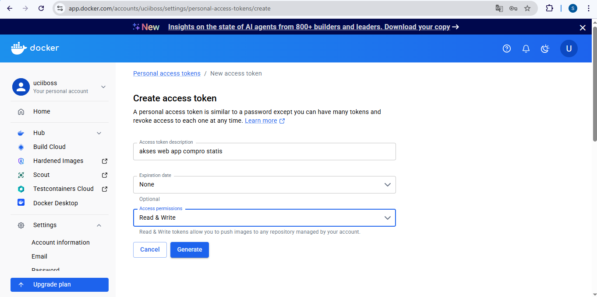
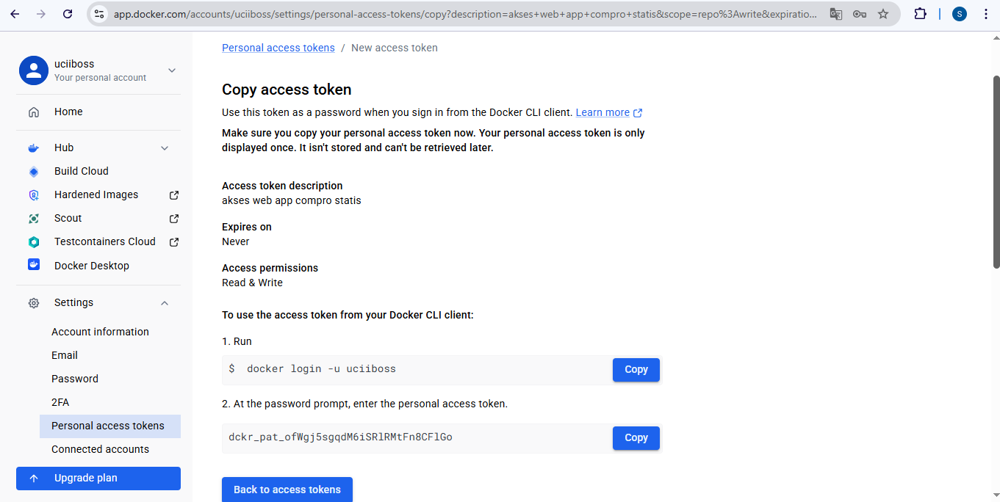
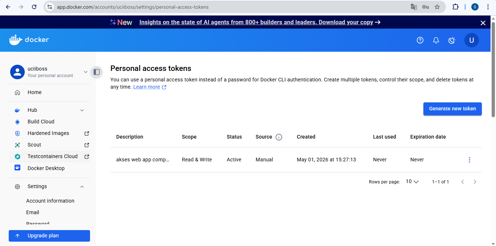
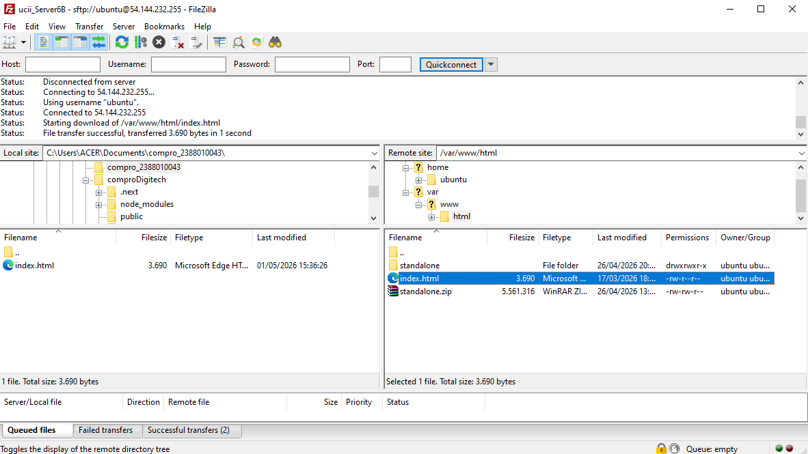
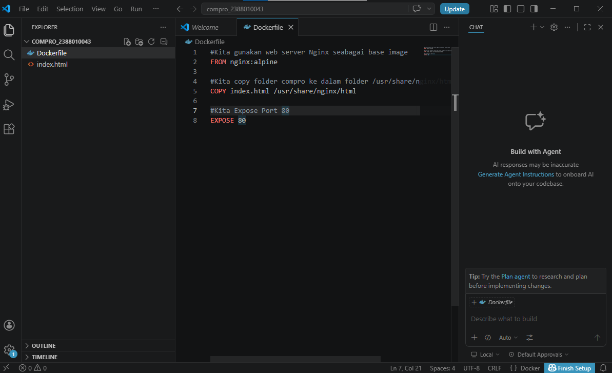
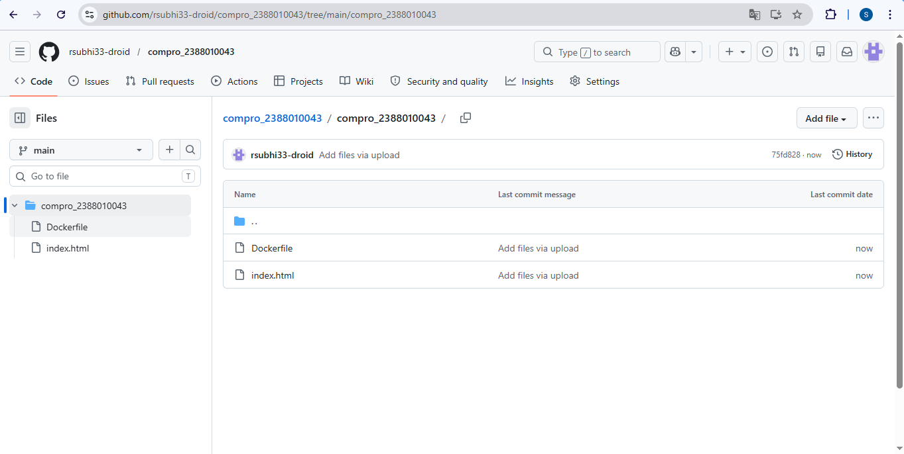

## Intro Docker Engine Instance EC2 AWS

1. install based docker dokumen https://docs.docker.com/engine/install/ubuntu/
   - uninstall old version docker

   - install Docker
     a. sudo apt-get update && sudo apt-get upgrade
     b. sudo apt install ca-certificates curl
        sudo install -m 0755 -d /etc/apt/keyrings
        sudo curl -fsSL https://download.docker.com/linux/ubuntu/gpg -o /etc/apt/keyrings/docker.asc
        sudo chmod a+r /etc/apt/keyrings/docker.asc
    c. sudo tee /etc/apt/sources.list.d/docker.sources <<EOF
       Types: deb
       URIs: https://download.docker.com/linux/ubuntu
       Suites: $(. /etc/os-release && echo "${UBUNTU_CODENAME:-$VERSION_CODENAME}")
       Components: stable
       Architectures: $(dpkg --print-architecture)
       Signed-By: /etc/apt/keyrings/docker.asc
       EOF
    d. Update OS -> sudo apt-get update
    e. install Docker -> sudo apt install docker-ce docker-ce-cli containerd.io docker-buildx-plugin docker-compose-plugin
    f. cek instalation -> sudo systemctl status docker
       

2. Registrasi Docker Hub
   - URL -> https://hub.docker.com
   - Continue with Github

3. Create Repository for Docker
   - Klik menu -> Hub -> Repositories
   - Klik Tombol New Repositoories
   - Isi Nama repo dengan format compro_nim dan deskripsinya Docker untuk Web App Compro Statis Milik Muhammad Inggar
   - Pastikan Public
     
     

4. Create Token Access
   - Klik Profile -> Account Setting -> Personal Access Token 
   - Klik Generate new Token
   - Isi deskripsi
   - expiration -> None
   - Access Permission -> Read & Write
   
   
   

5. Create Projek di Lokal
   - Buat new folder 'compro_nim'
   - masuk filezilla -> download file index.html -> masukan ke dalam folder compro_nim
    
   - Buat file Dockerfile dengan isi sebagai berikut
     FROM nginx:alpine
     COPY index.html /usr/share/nginx/html
     EXPOSE 80
     

6. Push Projek ke github
   - Bikin Repositprie baru 'compro_nim'
   - upload/push folder compro_nim
     
  

    
  