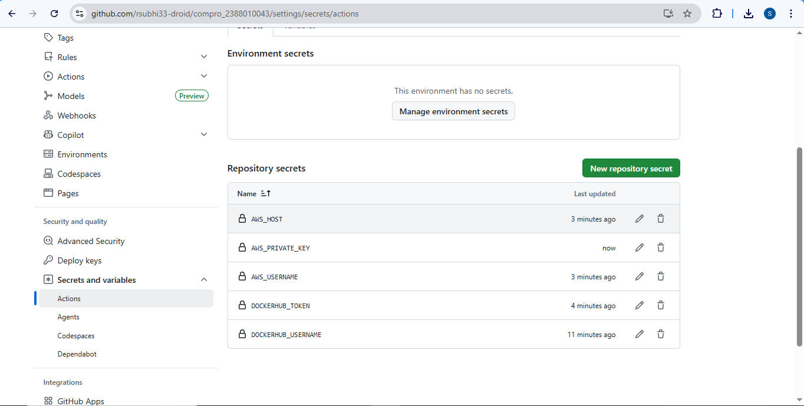
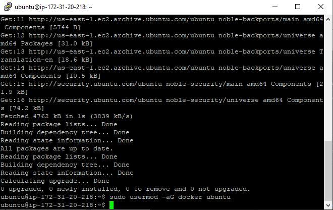
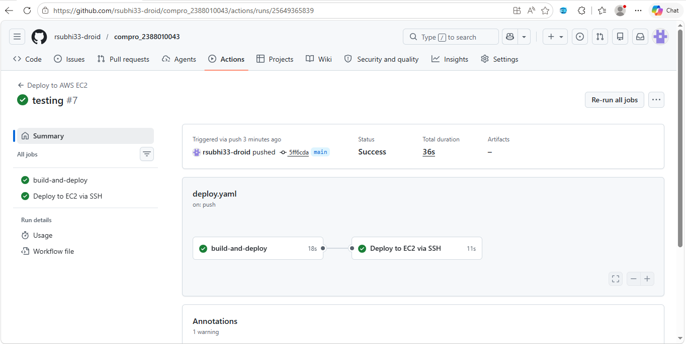

# Moderenisasi CI/CD

1. Mengisi Secrets Variable di Github Actions
   - Buka repo di github
   - Klik sttings -> Secret and Variables -> Action
   - Klik New Repo secret
   - Isi Nama = DOCKERHUB_USERNAME dan Value = username akun docker
   - Klik New Repo Secret
   - Isi Nama = DOCKERHUB_TOKEN dan Value = token akun docker
   - Klik New Repo Secret
   - Isi Nama = AWS_HOST dan Value = ip Public EC2 Instance
   - Klik New Repo Secret
   - Isi Nama AWS_USERNAME dan Value = ubuntu
   - Klik New Repo Secret
   - Isi Nama = AWS_PRIVATE_KEY dan Value = file.pem (berisi tanda petik di awal dan di akhir juga)
   

2. Melakukan Edit File Pipeline di Github
   - Buka Projek compro_2388010052
   - Buat Folder Baru .github -> Buat folder workflows -> Buat File deploy.yaml
   - Isi File deploy.yaml sebagai berikut:

name: Deploy Next.js to AWS EC2
on:
  push:
    branches: [ main ]
jobs:
  build-and-deploy:
    runs-on: ubuntu-latest
    steps:
    - name: Checkout code
      uses: actions/checkout@v4
    - name: Login to Docker Hub
      uses: docker/login-action@v3
      with:
        username: ${{ secrets.DOCKERHUB_USERNAME }}
        password: ${{ secrets.DOCKERHUB_TOKEN }}
    - name: Build and push Docker image
      uses: docker/build-push-action@v5
      with:
        context: .
        push: true
        tags: ${{ secrets.DOCKERHUB_USERNAME }}/compro_2388010052:latest

  deploy:
    needs: build-and-deploy
    runs-on: ubuntu-latest
    name: Deploy to EC2 via SSH and run docker compose
    steps:
    - name: SSH and deploy
      uses: appleboy/ssh-action@v1.0.3
      with:
        host: ${{ secrets.AWS_HOST }}
        username: ${{ secrets.AWS_USERNAME }}
        key: ${{ secrets.AWS_PRIVATE_KEY }}
        port: 22
        script: |
          docker rm -f compro_2388010052 || true
          docker pull ${{ secrets.DOCKERHUB_USERNAME }}/compro_2388010052:latest
          docker run -d --name compro_2388010052 -p 80:80 ${{ secrets.DOCKERHUB_USERNAME }}/compro_2388010052:latest

3. Sebelum melakukan commit dan synch pada File
   - Pastikan sudah disable apache2 -> sudo systemctl disable apache2
   - Pastikan sudah stop apache2 -> sudo systemctl stop apache2
   - Pastikan user ubuntu sudah ditambahkan ke docker -> sudo usermod -aG docker ubuntu
   - Baru lakukan commit dan push ke Github
   
   

4. Update Title 
   
   
