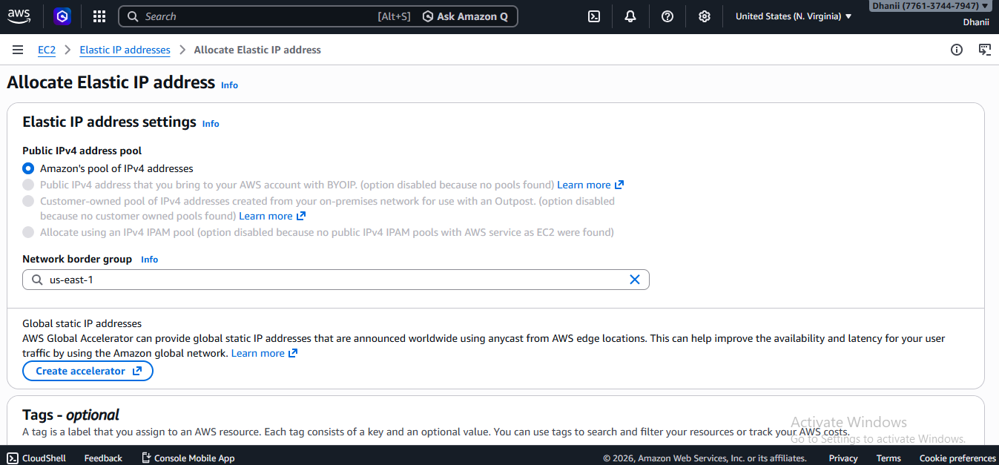
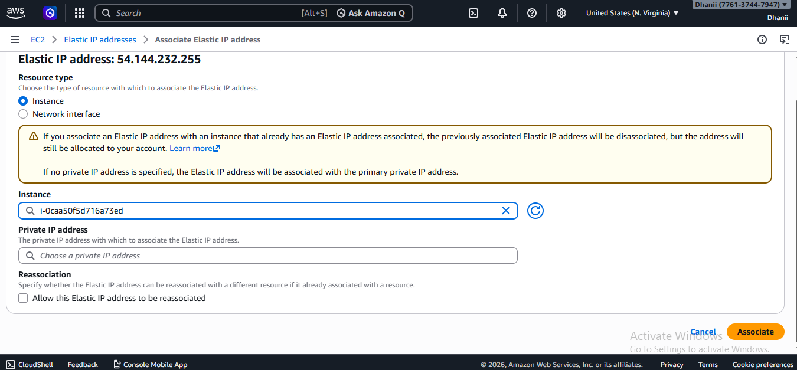
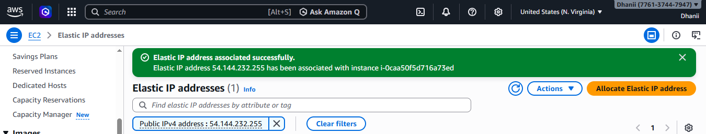
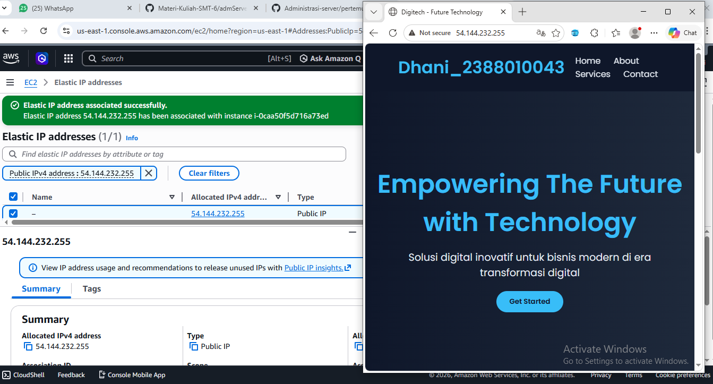

## Membuat elastic IP

1. Jalankan instance
2. ke menu netword & Security, pilih elastic ip
   - Klik menu Allocate Elastic Ip Adress 
   - pilih Amazon's pool of IPv4 addresses
   - Network Border Group (South East Asia)
   - Isi tag (Key= server_2388010043 = praktikum elastic ip) 
   - Klik allocate 
3. Assosiciet kan elastic ip segera mugkin (> 1 jam akan kena cost)
   - Klik nama IP nya
   - Pilih Action > Associate Elastic IP address 
   - Resource type pilih instance
   - Pilih Instance (server_2388010052) 
   - Klik Assosiate 
   - Berhasil membuat elastic ip dan Coba 