## Melakukan uploading web apps dynamic ke EC2 AWS

1. Pastikan Web Apps Dynamic tidak error di localhost
2. Jika sudah tanpa error, membuat folder build
   - npm run build
   - pastikan menghasilkan folder .next/standlone didalam tersedia folder static 
    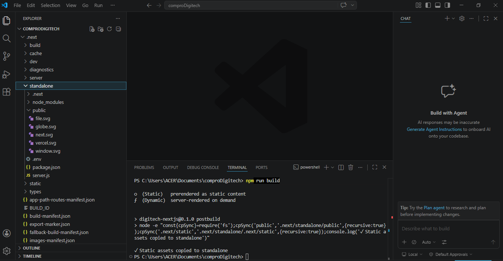
    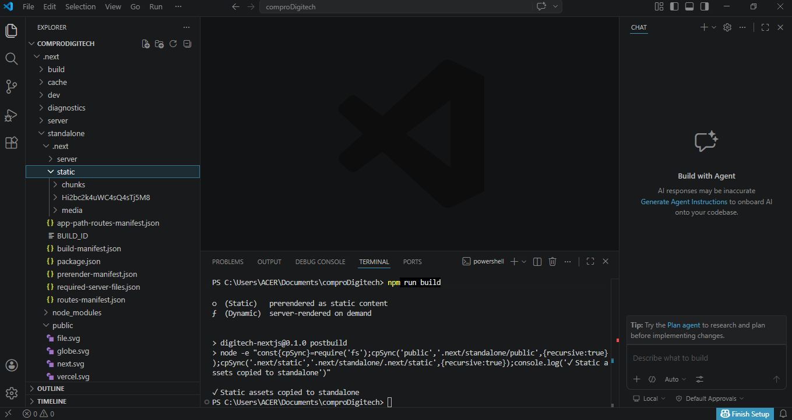
3. Proses Upload File Folder Standalone
   - Lakukan Proses Acchive pada folder .next/standalone dan folder public
   - Running Instance -> Connect Open SSH -> Connect FileZilla
   - upload file hasil archive ke EC2 AWS menggunakan FileZilla
     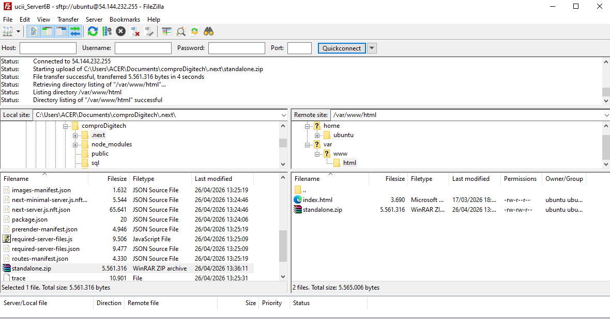
   - ekstrak file hasil archive
     1. Install tools Unzip di EC2
        - sudo apt install unzip -y 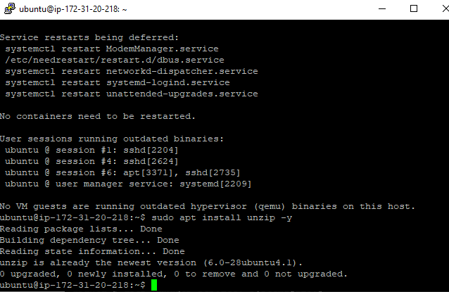
     2. cd /var/www/html
     3. command ls untuk cek
     4. Ekstrak file hasil archive
        - unzip nama_file.zip 
          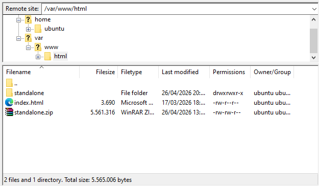
4. Export dbcompro dari localhost dari database phpmyadmin dalam bentuk sql
   - masuk ke user compro (command sudo mysql -u userCompro -p)
   - masukan password 
   - Cek database dbComrpo (show databases;)
   - command (use dbCompro)
   - paste isi database sql (hilangkan ENGINE=InnoDB DEFAULT CHARSET=utf8mb4 COLLATE=utf8mb4_0900_ai_ci) dulu 
   - cek tabel apakah sudah terisi
   - select * from users;
     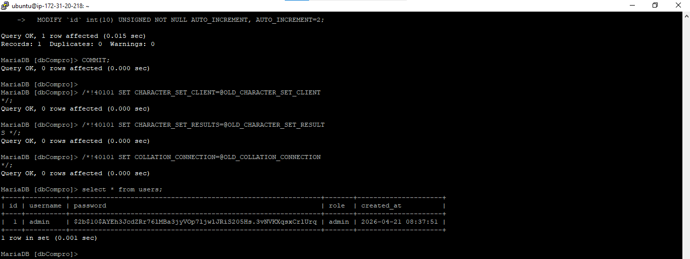
   - select * from berita;
     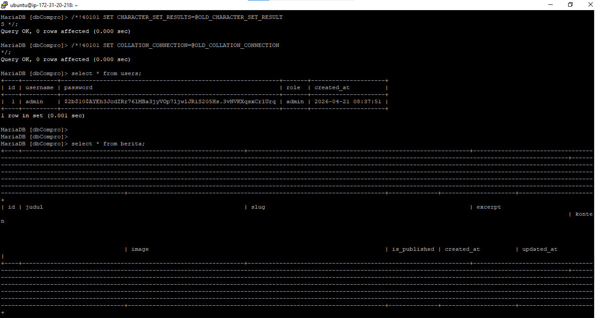
    
5. Seseuaikan isi file .env di file zilla   
   - masukan user pw dll nya sesuaikan 
   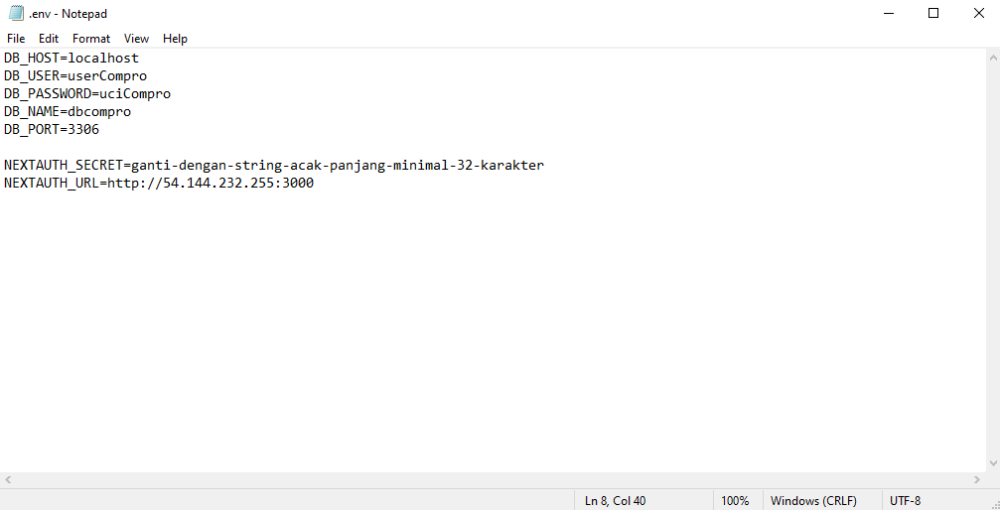

6. di Terminal SSH cd ke folder standalone run apps
   - exit database
   - cd standalone
   - pm2 start server.js 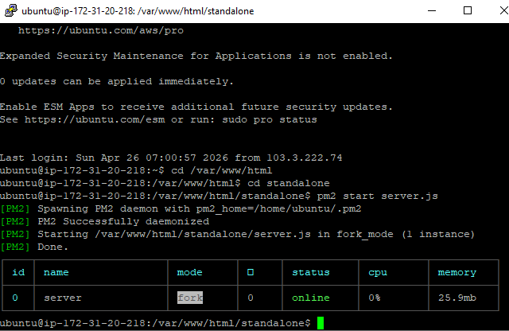
   - pm2  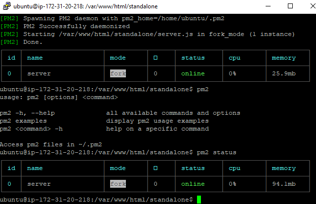

7. Buka port di security group EC2
   - Klik nama security di instance scroll sampe ada link
   - edit inbound rules
   - add rule
   - port 3000
   - save rule
   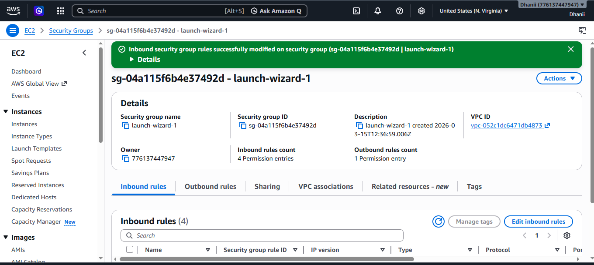

8. Akses Web Compro dengan memasukan IP Public EC2 AWS dan port 3000
   - masuk backend admin dengan link 
   - cek berita 
   - berita berhasil di buat 

